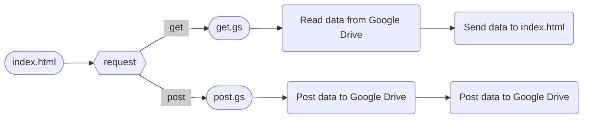

# Google App Script

範例雲端硬碟：https://drive.google.com/drive/folders/1-lu09sgUFEAN3iBVmhsIxqOV6fABcHvj

範例參考網址：https://www.wfublog.com/2017/01/google-apps-script-spreadsheet-write-data.html

- getData 拿資料

- postData 上傳資料

- 權限要打開

- 一定要部署

---

### flowchart

https://mermaid.js.org/syntax/flowchart.html




---

### Process of Get data from Drive

1. [Google Drive](https://drive.google.com/) : 新建試算表 ( `data.xlsm` )、新建兩個Google Apps Scripts ( `get.gs` )

2. `get.gs` 檔案中新建函數 `doGet` (一定要叫這個名字)

    ```javascript
    function doGet() {
      const folder = DriveApp.getFolderById("1sYpxMW1eiMoo13OicFxBbi__MStqPxpZ"); // folder id from URL
      const files = folder.getFiles();
    
      const output = {"data":[]};
    
      while (files.hasNext()) {
        const file = files.next();
        const blob = file.getBlob()
    
        output.data.push({
          "name"    : file.getName(),
          "id"      : file.getId(),
          "MimeType": file.getMimeType(),
          "url"     : file.getUrl(),
          "bytes"   : blob.getBytes(), 
        })
      }
    
      var stringResult = JSON.stringify(output);
      return ContentService.createTextOutput(stringResult).setMimeType(ContentService.MimeType.JSON);
    }
    ```

3. 部署網頁程式

    - 選擇新增部署
    - 選取類型：網頁應用程式
    - 執行身份：我
    - 誰可以存取：只有我自己

### Process of Post data to Drive

1. [Google Drive](https://drive.google.com/) : 新建試算表 ( `data.xlsm` )、新建兩個Google Apps Scripts ( `post.gs`, `get.gs` )

2. `post.gs` 檔案中新建函數

    ```javascript
    function doPost(e) {
      var param = e.parameter;
      var left = param.left;
      var right = param.right;
      var replyMsg = 'left' + left + 'right' + right;
      doGet(e)
      return ContentService.createTextOutput(replyMsg);
    }
    
    function doGet(e) {
      var params = e.parameter;
      var sheetUrl = params.sheetUrl;
      var sheetTag = params.sheetTag;
    
      var SpreadSheet = SpreadsheetApp.openById(sheetUrl);
      var Sheet = SpreadSheet.getSheetByName(sheetTag);
      Sheet.appendRow([params.left, params.right]);
      
      return ContentService.createTextOutput(true);
    }
    ```


---

#### Advanced Google services ([how to](https://developers.google.com/apps-script/guides/services/advanced?hl=zh-tw#enable_advanced_services))

1. 開啟 Apps Script 專案。
2. 按一下左側的「編輯器」圖示 code <>。
3. 在左側的 [服務] 旁邊，按一下 [新增服務] add +。
4. 選取所需 Google 服務，然後按一下 [新增]。

#### PDF manage


---


#### Get (Get data from Google Drive)

1. `index.html` 發送GET請求到 `get.gs`。
2. `get.gs` 從Google Drive中獲取數據。
3. `get.gs` 將獲取的數據作為回應發送給 `index.html`。
4. `index.html` 接收到回應，處理或顯示獲取的數據。
5. (可選) `index.html` 發送確認數據到 `get.gs`，可能是用於確認接收到數據或進行其他後續操作。

#### Post (Post data to Google Drive)

1. `index.html` 發送POST請求到 `post.gs`。
2. `post.gs` 處理接收到的數據，將其保存到Google Drive或其他數據源中。
3. (可選) `post.gs` 返回成功的回應給 `index.html`，表示數據已成功處理。

#### Improve

1. **驗證和授權檢查**：在`get.gs`和`post.gs`中，你可以添加驗證和授權檢查的邏輯，以確保只有授權的用戶可以訪問和修改數據。
2. **錯誤處理**：在處理數據時，考慮添加錯誤處理機制，例如處理數據讀取失敗或寫入失敗的情況，並向用戶提供有關錯誤的適當信息。
3. **數據格式驗證**：在`post.gs`中，對接收到的數據進行驗證，確保數據的格式和內容符合預期，避免不正確或損壞的數據進入系統。
4. **數據安全性**：考慮使用加密或其他安全措施來保護在數據傳輸和儲存過程中的數據安全性。 5. **用戶界面改進**：在`index.html`中，根據需要改進用戶界面，例如添加輸入驗證、提供用戶友好的錯誤提示等。


```javascript
/* -- Google App Script for Sheet--*/
function parseSheet(sheetUrl, sheetTag){
  const SpreadSheet = SpreadsheetApp.openById(sheetUrl);
  const Sheet = SpreadSheet.getSheetByName(sheetTag);
  const table = Sheet.getRange(1,1,Sheet.getLastRow(), Sheet.getLastColumn()).getValues();
  return table;
}
```
